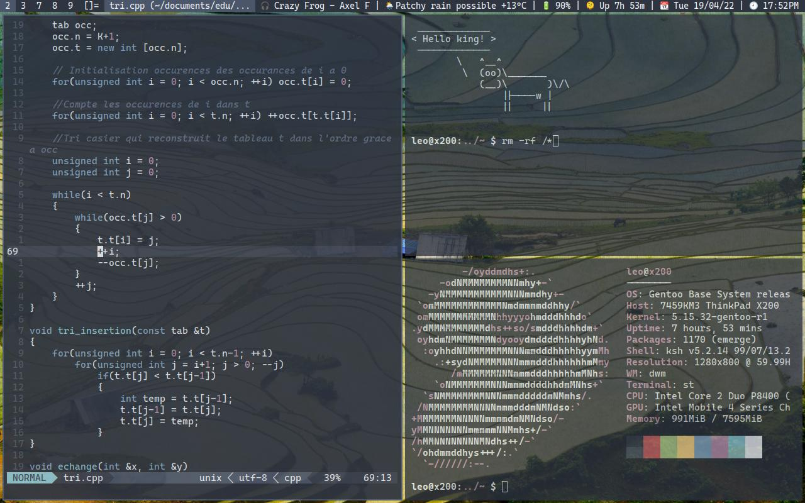

# leg7 dwm

This is my build of dwm, the suckless dynamic window manager for X available at https://dwm.suckless.org.

My build is based on version 6.3 (2022-01-07)



## Features

Since dwm is a suckless utility the configuration file is just a header file, in this case config.def.h.
If you want to know more about my settings you should look at that file.
You will find hotkey settings, theme, fonts and more informations.

### Here is a brief list of notable features/patches:

* Functional gaps
* Per-tag rules: every tag can have different a layout, gaps, stacks...
* Strict focus (i.e you can only focus a window with the keyboard or on mouse click this avoids unintentionally loosing focus of windows)
* Hide vacant tags: Display only the tags you are using in the statusbar
* Shift tools: Shift between tags but also shift windows between tags
* Stickyyy: Make a window follow you on every tag
* Emoji support (you need to have libXft patched with [bgra support](https://gitlab.freedesktop.org/xorg/lib/libxft/-/merge_requests/1.patch))
* Ordered patches for automatic patching with portage
* A small and modular statusbar written in sh that supports:
    * current song name with mpd
    * weather (make sure change the configuration for your city)
    * battery (if you have one)
    * uptime with "Easter eggs"
    * date and time with gnu-date
* [Nord theme](https://www.nordtheme.com/)

## Install guide

```
git clone https://git.leonardgomez.xyz/leg7/dwm
cd dwm
make Install
```

Please refer to dwms documentation for more details
